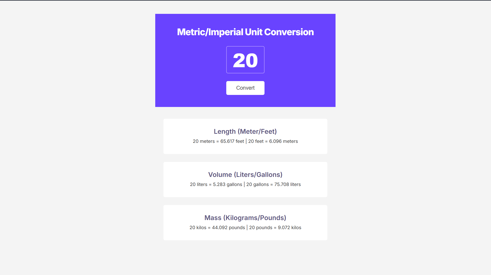

# Unit Converter

A responsive Metric/Imperial Unit Conversion web app built with HTML, CSS, and JavaScript.

## Features

- Convert:
  - Meters ↔ Feet
  - Liters ↔ Gallons
  - Kilograms ↔ Pounds
- Responsive design for desktop, laptop, and mobile
- Interactive UI using JavaScript
- Clean card layout based on a Figma design

## Built With

- HTML5
- CSS3
- JavaScript

## What I Learned

During this project, I practiced:

- Flexbox layout
- Responsive design with media queries
- DOM manipulation
- Event listeners
- JavaScript functions
- `.innerHTML`
- `.toFixed()`
- Converting Figma designs into real websites

## Live Demo
https://lets-change-units.netlify.app/

## Screenshot

## Author

Made by [Peter Paing]